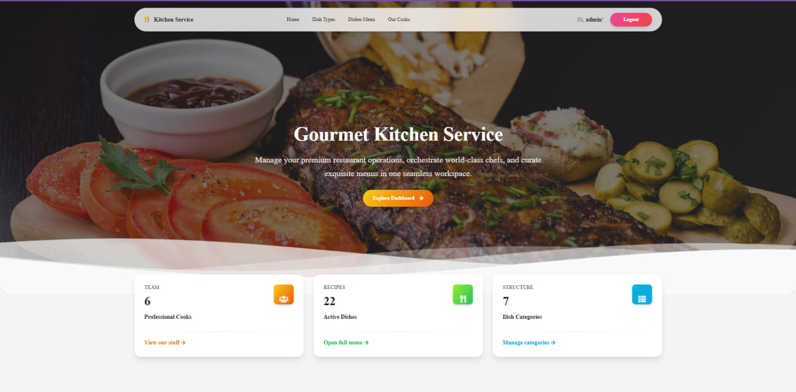
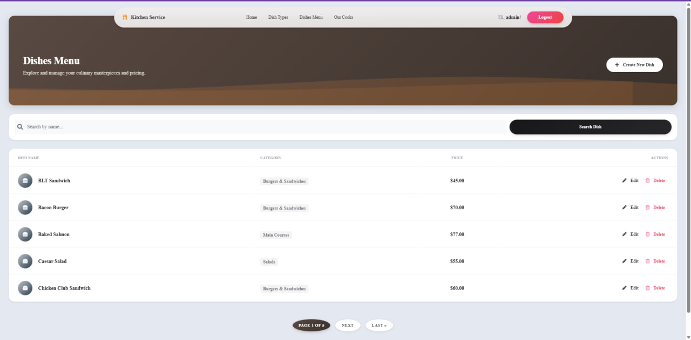
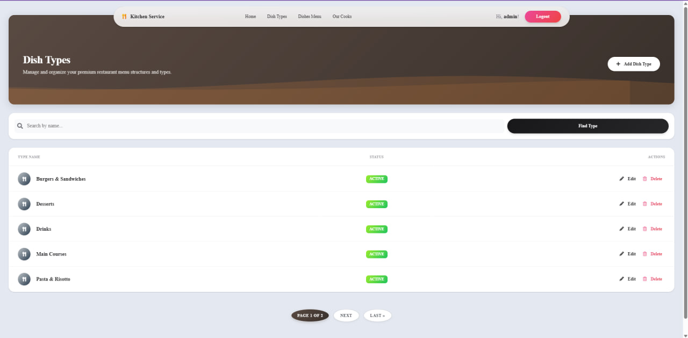

# Kitchen Service

Django-based web application for managing a kitchen service, cooks, dishes, and ingredients in a restaurant. This project was developed as part of the Mate Academy Python Developer Course.

## Check it out!

[Kitchen Service project deployed to Render](https://kitchen-service-ioid.onrender.com/)

## Installation

Python3 must be already installed.

Repository URL: [https://github.com/Sacchar20/kitchen-service](https://github.com/Sacchar20/kitchen-service)

Run the following commands in your terminal:
1. `git clone https://github.com/Sacchar20/kitchen-service.git`
2. `cd kitchen-service`
3. `python3 -m venv .venv`
4. `source .venv/bin/activate`  # On Windows use: `.venv\Scripts\activate`
5. `pip install -r requirements.txt`
6. `python manage.py runserver`

## Features

* **Custom User Model** — Implemented custom Cook model with authentication and years of experience validation.
* **Full CRUD Operations** — Management for Dishes, Dish Types, and Cooks directly from the website interface.
* **Access Control** — Secure views with authorization requirements preventing unauthorized actions.
* **Clean UI** — Responsive interface built with Bootstrap 5, customized for better user experience.
* **Admin Panel** — Powerful built-in Django admin dashboard for advanced data management.

## Demo Credentials

To test the application without creating a new account, you can use the following credentials:

* **Username:** `admin`
* **Password:** `1a2b3c4d`

## User Interface

### Home Page (Dashboard)

### Dishes Menu (with Search & Pagination)

### Dish Types Management

